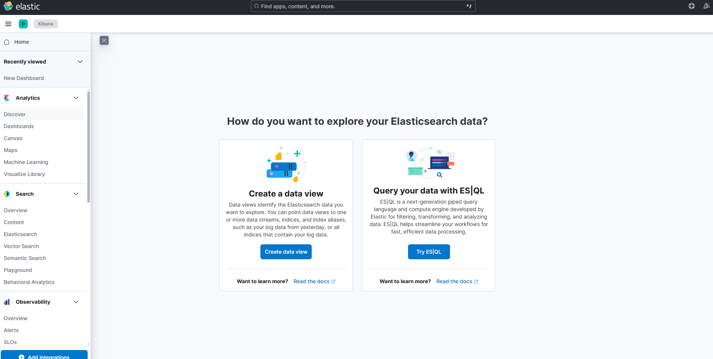
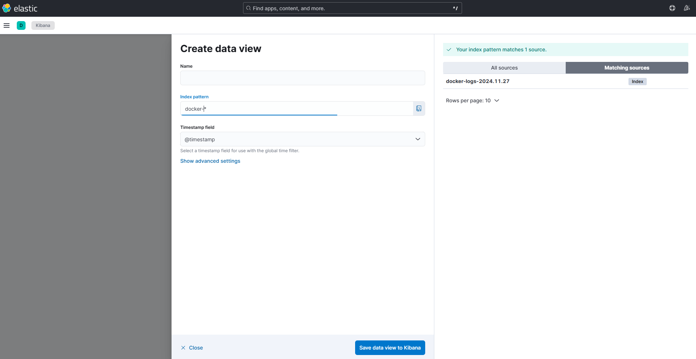
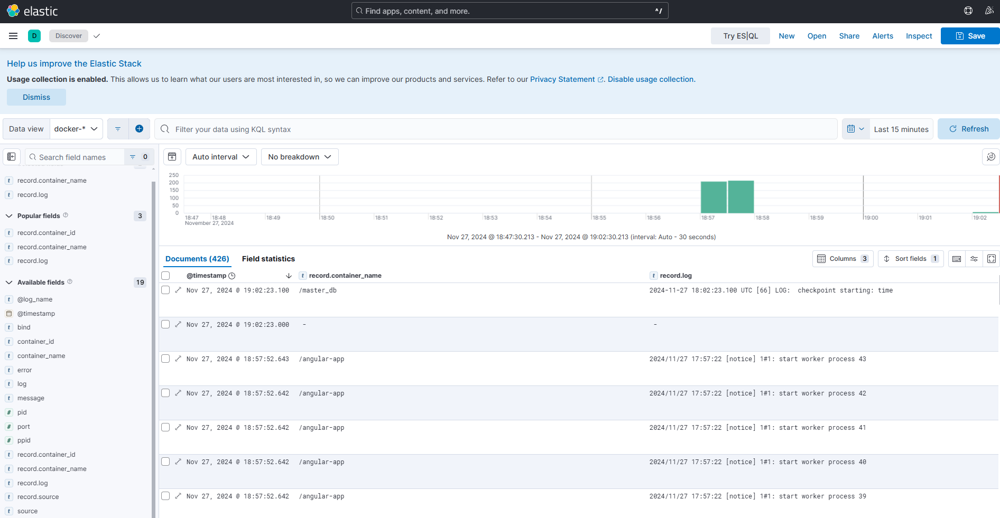
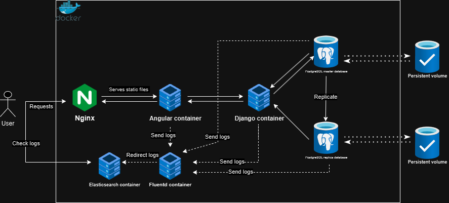

# ImageCaptionner Cloud Project

<!-- TABLE OF CONTENTS -->
<details>
  <summary>Table of Contents</summary>
  <ol>
    <li>
      <a href="#How to run the project">How to run the project</a>
    </li>
    <li>
        <a href="#Usage">Usage of the project</a>
    </li>
    <li>
        <a href="#How it works">How it works</a>
    </li>
    <li>
        <a href="#Acknoledgments">Acknoledgments</a>
    </li>
  </ol>
</details>

## About the Project

This is a project that is part of the Cloud and Virtualization course. 
It's an Angular & Django Project based project that aims at discovering the basics of those frameworks. 
This project takes into input an image and returns a description of it made via the BLIP image captioning model hosted from hugging face. 
The project was made using docker, especially docker compose which is a tool for running multi-container applications.

### The project was built using:
 [![Angular][Angular.io]][Angular-url]
 [![Django][Django.io]][Django-url]
 [![hugging][hugging.io]][hugging-url]
 [![Docker][docker.io]][docker-url]
 [![Elastic][Elastic.io]][Elastic-url]
 [![Fluentd][Fluentd.io]][Fluentd-url]
 [![Kibana][Kibana.io]][Kibana-url]

## How to run the project

1. First you need to clone the repository by executing the following command:

```sh
git clone https://github.com/Hellysio/Projet-Cloud.git
```

2. You can then run the program in the root directory with:
```sh
docker compose up -d --build
```
3. You can then access the project on your browser using the following address:
```sh
http://localhost:9000/landing
```
4. Then, to stop the project, you can execute the following command: 
```sh
docker compose down -v
```

## Usage
The project also has the aim to test and understand how database replication is done. In this project, you can manually test if the replication was done corectly in the replica database by executing the following command. The data should also be persistant, which means that if the database container is restarted or stopped, the data should still be present.:
```sh
./tests/db-test.sh 
```

Logs are also stored thanks to the EFK logging Stack. You can also check the logs of the project which are specifically sent to Kibana using Fluentd and Elasticsearch. 
1. To access them, simply head to the following address:
```sh
http://localhost:5601/app/discover#/
```
2. And then create a data view :
<div align="center">
    <a>
        
    </a>
</div>
3. Create a view using the pattern :

```sh
docker-*
```

<div align="center">
    <a>
        
    </a>
</div>
4. Head back to the Discover tab and filter by <ins>record.container_name</ins> and <ins>record.log</ins> You should be able to see the logs.
<div align="center">
    <a>
        
    </a>
</div>

## How it works

The project is a multi-container application. Each container is in the same network and communicates with each other. It can be represented for the user like this:  
<div align="center">
    <a>
        
    </a>
</div>
The user can make requests to static files hosted by Nginx. The static files are from the Angular container(front) and the container communicates with the Django container (back).
The Django container then stores data inside the master PostgreSQL database and the data will be replicated locally to the replica database in case of a failure from the master database. 
The data is stored on persistent volumes. Logs are monitored by a EFK logging Stack with a Fluentd, Kibana and Elasticsearch containers.

<!-- ACKNOWLEDGMENTS -->

## Acknoledgments 

Being relatively new to Angular/Django and Docker 
I primarly relied on official documentation but also on quality tutorials such as: 
* [Youtube series about Docker development by Marcel Dempers](https://github.com/marcel-dempers/docker-development-youtube-series)
* [Youtube video to learn how to Dockerize an Angular app using Nginx](https://youtu.be/-o5l6zFJ9_o)
* [Tutorial on Postgres replication using Docker compose](https://github.com/madeindjs/docker-postgres-replication)


[Angular.io]: https://img.shields.io/badge/Angular-DD0031?style=for-the-badge&logo=angular&logoColor=white
[Angular-url]: https://angular.io/

[Kibana.io]: https://img.shields.io/badge/Kibana-005571?style=for-the-badge&logo=Kibana&logoColor=white
[Kibana-url]: https://www.elastic.co/fr/kibana

[hugging.io]: https://img.shields.io/badge/-HuggingFace-FDEE21?style=for-the-badge&logo=HuggingFace&logoColor=black"
[hugging-url]: https://huggingface.co/

[Docker.io]: https://img.shields.io/badge/Docker-2CA5E0?style=for-the-badge&logo=docker&logoColor=white
[Docker-url]: https://www.docker.com/

[Django.io]: https://img.shields.io/badge/Django-092E20?style=for-the-badge&logo=django&logoColor=green
[Django-url]: https://www.djangoproject.com/

[Elastic.io]: https://img.shields.io/badge/Elastic_Search-005571?style=for-the-badge&logo=elasticsearch&logoColor=white
[Elastic-url]: https://www.elastic.co/fr/elasticsearch

[Nginx.io]: https://img.shields.io/badge/Nginx-009639?style=for-the-badge&logo=nginx&logoColor=white
[Nginx-url]: https://nginx.org/

[Fluentd.io]: https://img.shields.io/badge/Fluentd-599CD0?style=for-the-badge&logo=fluentd&logoColor=white&labelColor=599CD0
[Fluentd-url]: https://www.fluentd.org/

